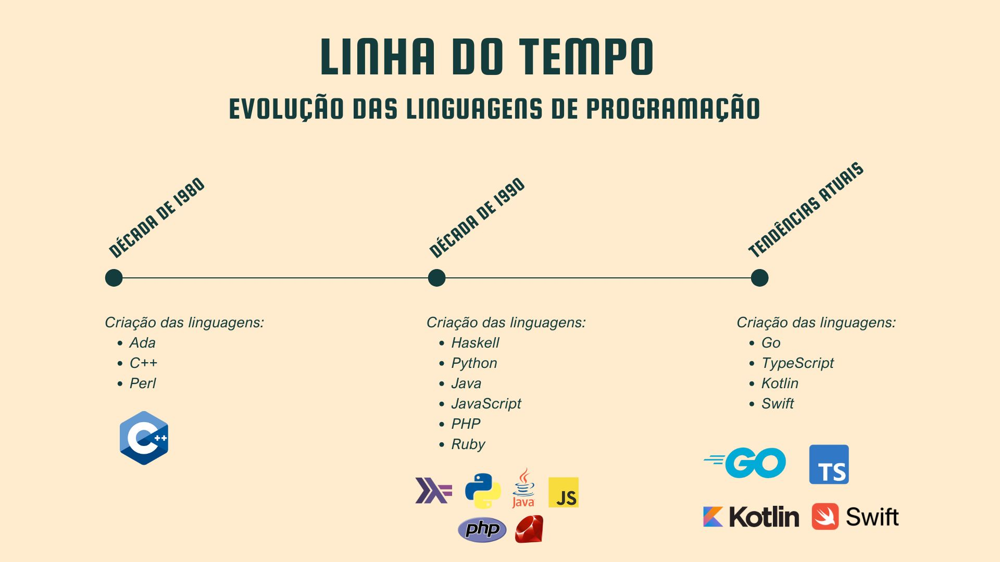

# **Introdução às Linguagens**

A história das linguagens de programação remonta aos primeiros computadores mecânicos, quando os códigos eram altamente especializados e baseados em notações matemáticas complexas, tornando-os difíceis de entender e reproduzir. No século XX, o desenvolvimento de compiladores permitiu o surgimento das linguagens de alto nível, com sintaxes mais acessíveis e intuitivas. Essa evolução não apenas reflete o avanço da tecnologia, mas também revolucionou a forma como interagimos com a computação, transformando a programação em uma ferramenta poderosa e acessível. Desde os primórdios até as linguagens modernas, cada marco nessa jornada ajudou a moldar o mundo digital que conhecemos hoje.

## Linha do Tempo das Linguagens de Programação

### Antes da década de 40
Em 1801, o **Tear de Jacquard**, criado por **Joseph-Marie Jacquard**, revolucionou a automatização ao usar cartões perfurados para controlar padrões de tecelagem. Essa inovação foi a primeira a armazenar instruções mecânicas de forma programável, inspirando futuras máquinas computacionais.

Entre 1822 e 1837, **Charles Babbage** projetou a **Máquina Diferencial**, um avanço para cálculos matemáticos complexos. Embora nunca concluída, sua ideia pioneira introduziu conceitos como operações automatizadas e preparou o terreno para a Máquina Analítica (considerada o primeiro projeto de computador mecânico programável).

Em 1842, **Ada Lovelace** deu um passo revolucionário ao publicar notas sobre a Máquina Analítica de Babbage, incluindo um algoritmo para calcular números de Bernoulli. Esse trabalho, reconhecido como o primeiro programa de computador da história, não apenas demonstrou o potencial das máquinas para ir além de cálculos numéricos, mas também estabeleceu Ada como a **primeira programadora**, antevendo conceitos como loops e operações condicionais décadas antes dos computadores modernos.

Em 1936, **Alan Turing** formalizou a **Máquina de Turing**, um modelo teórico que definiu os fundamentos da computação moderna. Seu conceito de "máquina universal" provou que qualquer algoritmo poderia ser processado com um sistema de regras simples, estabelecendo as bases para as linguagens de programação e a ciência da computação.

### Década de 1940
Em 1943, teve início o desenvolvimento do **ENIAC (Electronic Numerical Integrator and Computer)**, o primeiro computador eletrônico programável de grande escala. Projetado para cálculos balísticos durante a Segunda Guerra Mundial, o ENIAC marcou uma revolução na computação por substituir sistemas mecânicos por válvulas eletrônicas, permitindo processamento milhares de vezes mais rápido. Apesar de sua programação ser feita por meio de cabos e interruptores — um processo complexo e manual —, o ENIAC pavimentou o caminho para arquiteturas modernas, influenciando diretamente a evolução das linguagens de programação e a computação digital como a conhecemos hoje. 

### Década de 1950
Em 1957, a **FORTRAN (FORmula TRANslation)**, desenvolvida pela IBM sob liderança de John Backus, tornou-se a **primeira linguagem de alto nível** amplamente adotada. Projetada para cálculos científicos e engenharia, a FORTRAN introduziu conceitos como loops e estruturas condicionais, permitindo que programadores escrevessem código mais próximo da matemática do que do assembly.

Já em 1958, o **LISP (LISt Processing)**, criado por John McCarthy, surgiu como a **primeira linguagem funcional**, revolucionando a inteligência artificial e a manipulação simbólica. Sua estrutura baseada em listas e recursão a tornou ideal para problemas complexos, influenciando linguagens como Python e Clojure.

Em 1959, o **COBOL (COmmon Business-Oriented Language)**, desenvolvido por Grace Hopper e outros, foi projetado para processamento de dados comerciais. Com sintaxe próxima do inglês, como MOVE TOTAL TO SALARY (é um comando típico da linguagem e significa "Transfira o valor de TOTAL para SALARY"), democratizou a programação para aplicações empresariais, dominando sistemas bancários e governamentais por décadas.

### Década de 1960 e 1970
Em 1970, Niklaus Wirth criou o **Pascal**, uma linguagem projetada para ensino de programação estruturada. Com sintaxe clara e rígida, o Pascal incentivava boas práticas de código e foi amplamente usado em universidades. Sua influência é visível em linguagens modernas como Delphi e até no JavaScript (com estruturas similares).

No mesmo ano, Dennis Ritchie desenvolveu a **linguagem C**. Pensada para ser eficiente e portátil, C combinava alto nível com acesso direto à memória (via ponteiros), tornando-se a base de sistemas operacionais como Unix e Windows. Sua sintaxe enxuta inspirou C++, Java, Python e muitas outras.

Já em 1972, o **Prolog (Programming in Logic)** surgiu como a principal linguagem de programação lógica, criada por Alain Colmerauer, o Prolog era ideal para IA, sistemas especialistas e problemas baseados em inferência (como jogos ou genealogia), introduzindo um paradigma totalmente diferente do imperativo.

Por fim, o **SQL (Structured Query Language)**, criado por Donald Chamberlin em 1974, **revolucionou o gerenciamento de bancos de dados relacionais**. A linguagem permitia manipular dados sem descrever *como* fazer, apenas *o quê* recuperar. Tornou-se padrão universal, usado até hoje em sistemas como MySQL e PostgreSQL.

### Década de 1980
Em 1980, a **linguagem Ada** foi desenvolvida para o Departamento de Defesa dos EUA, nomeada em homenagem a Ada Lovelace. Projetada para sistemas embarcados críticos (como aviões e controle de tráfego aéreo), Ada destacou-se por sua forte tipagem, concorrência nativa e ênfase em segurança e manutenibilidade. Sua sintaxe clara a tornou padrão em aplicações militares e aeroespaciais.

Em 1983, Bjarne Stroustrup introduziu o **C++**, uma evolução da linguagem C que revolucionou a programação ao unir desempenho de baixo nível com os princípios da orientação a objetos. Projetada para ser eficiente e versátil, o C++ permitia a criação de sistemas complexos com maior organização e reutilização de código, graças a recursos como classes, herança e polimorfismo. Sua capacidade de equilibrar controle de hardware e abstração de alto nível a tornou essencial em áreas como desenvolvimento de jogos, sistemas operacionais e aplicações financeiras. O C++ não apenas herdou a velocidade e a portabilidade do C, mas também estabeleceu padrões que influenciaram linguagens modernas como Java, C# e Rust.

Em 1987, Larry Wall criou o **Perl**, uma linguagem de script revolucionária conhecida por sua flexibilidade e poder no processamento de texto. Seu famoso lema "There’s more than one way to do it" refletia sua filosofia: múltiplas soluções para um mesmo problema, incentivando criatividade e adaptabilidade. Apesar de ter perdido espaço para Python e Ruby, seu legado persiste em sistemas legados e influenciou linguagens modernas, mantendo sua reputação como ferramenta poderosa para tarefas textuais.

### Década de 1990
Desenvolvida como um padrão para programação funcional pura, o **Haskell** introduziu conceitos avançados como avaliação preguiçosa e imutabilidade, tornando-se referência para linguagens como Scala e Elixir. Sua abordagem matemática e foco em evitar efeitos colaterais a tornam ideal para sistemas complexos e algoritmos de alta confiabilidade.

Criada por Guido van Rossum, o **Python** surgiu com a missão de ser legível e produtivo. Com sintaxe limpa e filosofia "Zen", tornou-se a linguagem mais popular para IA, automação e desenvolvimento web (Django/Flask), unindo simplicidade e poder.

Lançada pela Sun Microsystems (de James Gosling), a **Java** revolucionou com "Write Once, Run Anywhere" (WORA). Orientada a objetos e com gerenciamento automático de memória, dominou aplicações empresariais, Android e sistemas embarcados, mantendo-se relevante até hoje.

Criada em 10 dias por Brendan Eich para a Netscape, o **JavaScript** transformou-se no coração da web moderna. Originalmente para scripts simples, hoje (com Node.js e frameworks como React) roda em navegadores, servidores e até IoT, sendo a linguagem mais usada no mundo.

Desenvolvido por Rasmus Lerdorf para páginas dinâmicas, o **PHP** alimentou a web dos anos 2000 (WordPress, Facebook). Apesar de críticas, sua facilidade para integrar HTML e bancos de dados (MySQL) o mantém relevante, especialmente com versões modernas (PHP 8+).

Criada por Yukihiro Matsumoto, o **Ruby** priorizou a felicidade do programador com sintaxe intuitiva. Popularizou-se com o framework Ruby on Rails, que revolucionou o desenvolvimento web com convenção sobre configuração.

### Tendências Atuais
Desenvolvida pelo Google, a linguagem **Go (ou Golang)** foi criada para resolver problemas de escalabilidade, concorrência e simplicidade em sistemas distribuídos. Combinando a eficiência do C com sintaxe limpa e recursos nativos para concorrência, tornou-se popular em microsserviços, cloud computing e ferramentas de DevOps.

Criada pela Microsoft, o **TypeScript** surgiu como um superset do JavaScript, adicionando tipagem estática e recursos de programação orientada a objetos. Projetada para grandes aplicações front-end e back-end (com Node.js), tornou-se essencial em frameworks como Angular e React, melhorando a segurança e manutenibilidade do código JS.

Desenvolvida pela JetBrains, o **Kotlin** foi projetada para ser concisa, interoperável com Java e mais segura. Ganhou destaque ao se tornar a linguagem oficial para desenvolvimento Android, substituindo Java em muitos projetos modernos por sua produtividade e sintaxe intuitiva.

Lançada pela Apple, a **Swift** substituiu o Objective-C como linguagem padrão para iOS/macOS. Com sintaxe moderna, desempenho otimizado e segurança, acelerou o desenvolvimento de apps nativos, atraindo até desenvolvedores de outras plataformas.
