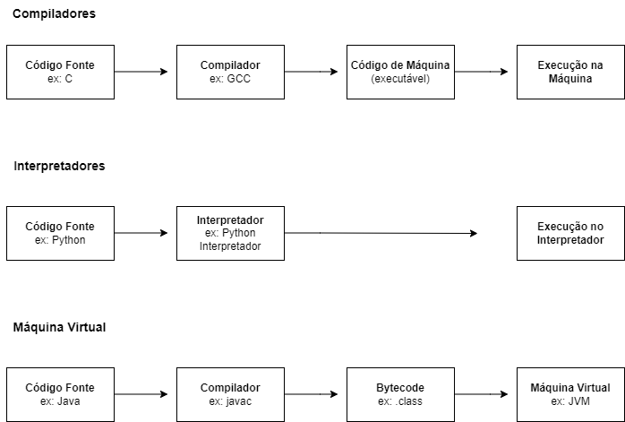

###  Diagramas de Ambientes de Programação

O computador deve converter os comandos dados em linguagem de alto nível para linguagem de máquina (códigos binários). Esta tarefa de conversão é feita por um programa especial de computador, isto é, um programa que recebe as instruções em linguagem de alto nível e dá como saída outro programa constituído de instruções binárias. Essa conversão é realizada por programas especiais, que podem ser classificados em três categorias principais: **compiladores**, **interpretadores** e **máquinas virtuais**.

