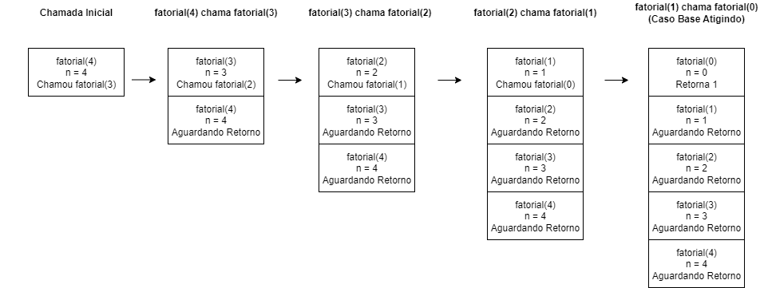
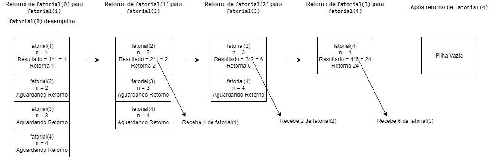

# Implementação de Pilha de Chamadas

## Objetivo
Demonstrar e explicar o funcionamento da pilha de chamadas em um exemplo de função recursiva e ilustrar como os valores são empilhados e retornados. A função escolhida foi o cálculo fatorial em python.

---

### Fatorial.py

     def fatorial(n):
       print(f"Chamada de fatorial({n})")

    if n == 0:
        print(f"Base case: fatorial(0) retorna 1")
        return 1
    else:
        resultado = n * fatorial(n - 1)
        print(f"Retornando de fatorial({n}): {n} * {resultado / n} = {resultado}")
        return resultado

     numero = 4
     print(f"\nCalculando o fatorial de {numero}:\n")
     fatorial(numero)

### Saída esperada ao rodar o código para fatorial(4):

    Calculando o fatorial de 4:

    Chamada de fatorial(4)
    Chamada de fatorial(3)
    Chamada de fatorial(2)
    Chamada de fatorial(1)
    Chamada de fatorial(0)
    Base case: fatorial(0) retorna 1
    Retornando de fatorial(1): 1 * 1.0 = 1
    Retornando de fatorial(2): 2 * 1.0 = 2
    Retornando de fatorial(3): 3 * 2.0 = 6
    Retornando de fatorial(4): 4 * 6.0 = 24

### Representação gráfica da pilha de chamadas

