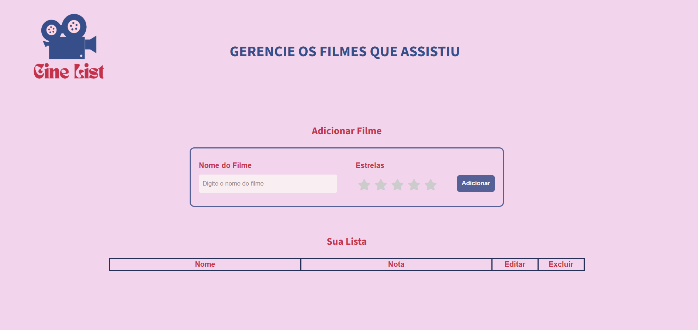

# Linguagens para Scripts e Web

Este projeto é uma **Single Page Application (SPA)** simples desenvolvida com **HTML, CSS e JavaScript**, que atua como um gerenciador de filmes. Ele demonstra a capacidade do JavaScript em linguagens para scripts e web para **manipulação de dados** em um contexto interativo no navegador.

---

## Funcionalidades 

O gerenciador (chamado de CineList) oferece as seguintes operações CRUD (Create, Read, Update, Delete):

* **Adicionar Filme (Create)**: Permite adicionar um novo filme à lista, incluindo seu nome e uma nota em estrelas.
* **Listar Filmes (Read)**: Exibe todos os filmes adicionados em uma tabela, mostrando o nome e a nota correspondente.
* **Editar Filme (Update)**: Permite modificar o nome e a nota de um filme existente.
* **Excluir Filme (Delete)**: Remove um filme da lista.

---

## Como Executar 

1.  Clone este repositório para sua máquina local.
2.  Navegue até a pasta `13-scripts-web/`.
3.  Abra o arquivo `index.html` em seu navegador de internet.

**Observação**: Como esta é uma SPA simples, os dados são armazenados apenas na memória do navegador e serão perdidos ao fechar ou recarregar a página. 

--- 

## Interface

